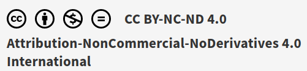

> AVISO: El texto contiene muchos enlaces embebidos que sólo funcionan si se abre el PDF desde un lector digital. Si se imprime, se perderá mucha información interesante. No obstante, en el apartado "Bibliografía" se han añadido los enlaces para aquellos lectores que deseen una copia impresa y puedan ver la información. 

---

Este documento se encuentra bajo una licencia Creative Commons de Atribución-CompartirIgual (CC BY-SA). 

Esto significa que puedes:

- Compartir: copiar y redistribuir el material en cualquier medio o formato.
- Adaptar: remezclar, transformar y construir sobre el material para cualquier propósito, incluso comercialmente.

Bajo las siguientes condiciones:

- Atribución: debes dar crédito de manera adecuada, proporcionar un enlace a la licencia e indicar si se han realizado cambios. Puedes hacerlo de cualquier manera razonable, pero no de una manera que sugiera que el licenciante te respalda a ti o al uso que hagas del trabajo.
- Compartir igual: si remezclas, transformas o creas a partir del material, debes distribuir tus contribuciones bajo la misma licencia que el original.

Para más detalles, consulta la [licencia completa](https://creativecommons.org/licenses/by-sa/4.0/legalcode.es).

---

> Para una versión actualizada de este libro visita esta Web: <https://gitlab.iesvirgendelcarmen.com/juangu/adt01-apuntes>.

\pagebreak
\tableofcontents
\pagebreak
