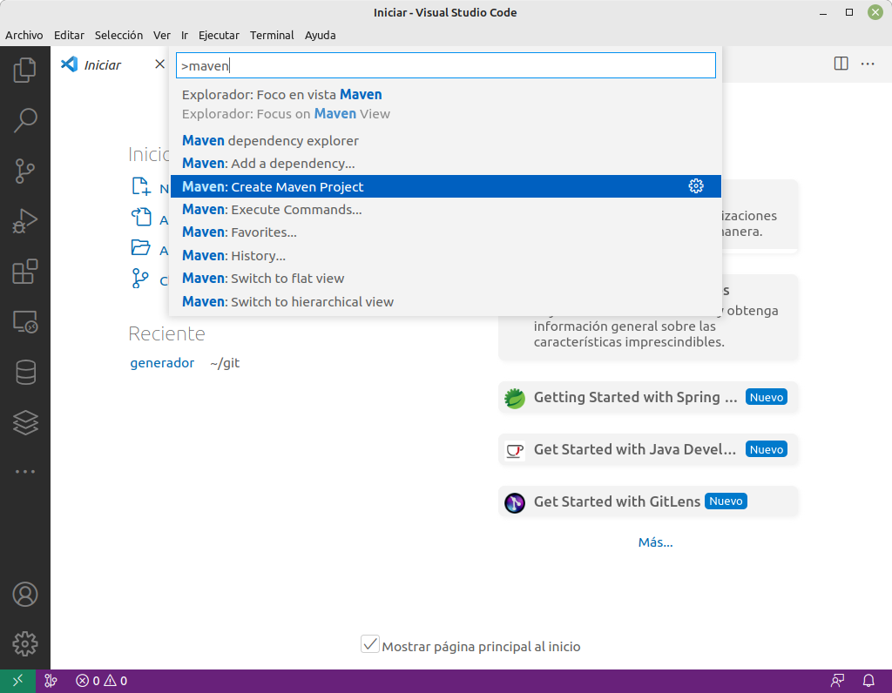
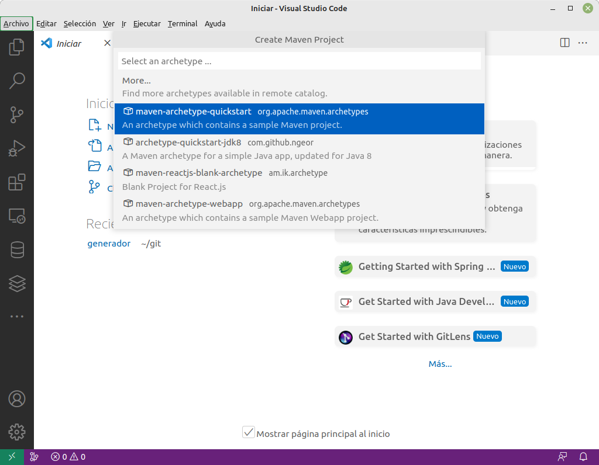
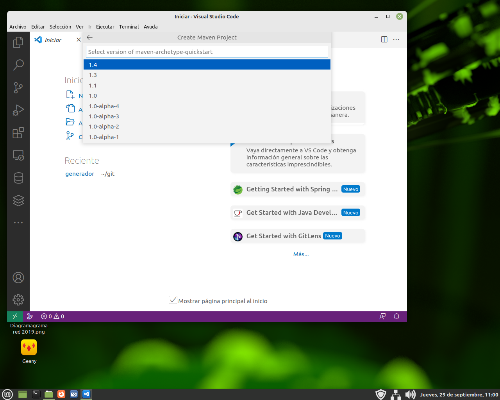
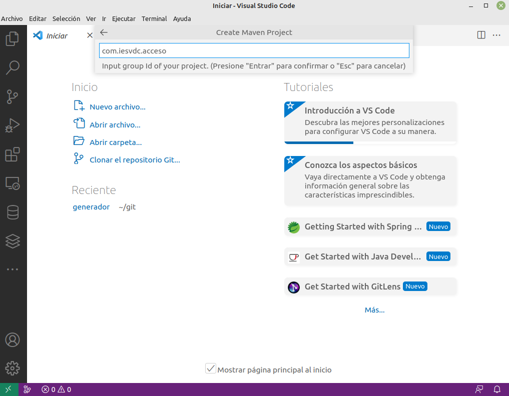
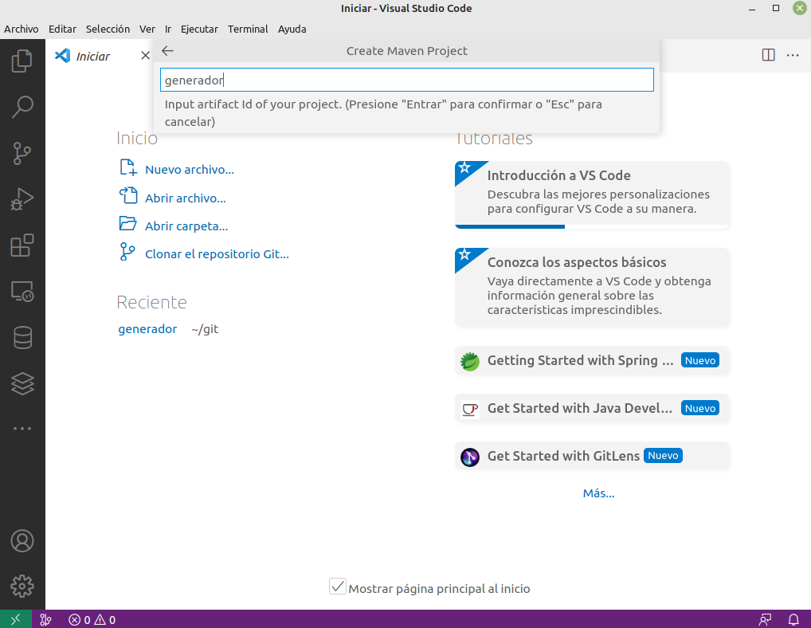

# Ejemplo de solución: prueba nivel

Ciclo formativo de 2º de Desarrollo de Aplicaciones Multiplataforma.
Nivel medio-avanzado.
Curso 2022-23.

## Descripción del ejercicio

Hacer un generador de personas, que tengan aleatoriamente:

* Nombre
* Apellidos
* DNI con letra
* email
* Dirección con ciudad y CP

Nos piden crear un proyecto Maven y un ejemplo de ejecución (por ejemplo renerar 1000 personas).

## Preparación del entorno

Aunque es muy similar en Windows, vamos a indicar los pasos a seguir en un equipo con Ubuntu 22.04 LTS.

Necesitamos tener instalado Java, para ello, desde una terminal tecleamos:

```bash
$ sudo apt install openjdk-17-jdk
```

La versión de Maven compatible con Java 17 hay que descargarla de internet, de su web oficial (<https://maven.apache.org>). En nuestro caso descargamos y descomprimimos en nuestro directorio personal, concretamente en **$HOME/usr** (usamos esta carpeta **usr** para albergar programas descargados como diferentes JDK, Tomcat, GlassFish, Netbeans, etc. sin necesidad de instalar y ensuciar el sistema operativo).

Para que funcione Maven, en nuestro .bashrz o .zshrc hay que hacer estos cambios:

```bash
export PATH=$PATH:$HOME/usr/apache-maven-3.8.6/bin
export MAVEN_HOME=$HOME/usr/apache-maven-3.8.6
```

Si no tenemos Visual Studio Code instalado, podemos instalarlo con snap:

```bash
$ sudo snap install code
```

## Preparación de los datos

Nos descargamos del INE todos los apellidos de españoles con frecuencia igual o mayor de 20: <https://www.ine.es/daco/daco42/nombyapel/apellidos_frecuencia.xls>.

Convertimos el XLS a CSV, del CSV sacamos los apellidos y lo mandamos a un archivo de texto (en unbuntu tendremos que instalarnos el paquete catdoc para tener el comando xls2csv):

```bash
$ cd git/generador
$ xls2csv apellidos_frecuencia.xls > apellidos.csv 
$ cat apellidos.csv | awk -F "," '{print $2 }' | sed 's/\"//g' | sort > apellidos.txt
$ 
```

## Implementando el generador

### Creación del proyecto

Nos instalamos las extensiones de Java (cuidado con las versiones preliminares, a veces no funcionan y hay que volver a versiones anteriores):

* Extension Pack for Java (incluye soporte para maven, ejecutar proyectos, etc.)
* Java Code Generators (para generar los constructores, getters y setters)
* Java Run (para que nos salga un texto "Run" sobre cualquier método "main" y ejecutar el código más fácilmente)

Ahora ya podemos crear el proyecto. Para ello usamos la paleta de comandos de Visual Studio Code (pulsamos Ctrl+shift+P) y escribimos maven, de la lista seleccionamos "Maven Project":



En el siguiente paso, seleccionamos el tipo de proyecto, concretamente "quickstart":



A continuación mantenemos la versión 14 (última) del plugin de Maven:



Ahora ya podemos darle nombre al paquete (pondremos **com.iesvdc.acceso**):



Finalmente damos nombre al proyecto: **generador** y a continuación nos preguntará dónde generar la carpeta que contendrá el proyecto y seguidamente que si queremos abrirlo:



¡Ya podemos empezar a escribir código!

### Inicialización del repositorio

Ahora inicializamos el repositorio, añadimos los primeros archivos y cambiamos a la rama desarrollo:

```bash
git init
git add .gitignore Readme.md pom.xml src docs
echo .vscode >> .gitignore
echo target >> .gitignore
git commit -m "Creación del proyecto"
git branch dev
git checkout dev
```

### Modelos

El primer paso es modelar las clases *base* que contienen nuestros objetos. Así, crearemos Persona y Personas, que se encargarán de hacer la *magia*.
#### Persona

Fichero Persona.java:

```java:src/main/java/com/iesvdc/acceso/modelos/Persona.java

```

**Para ampliar:** Investiva qué es Lombok para Java y piensa para qué lo usarías con la clase *Persona*.
#### Personas

